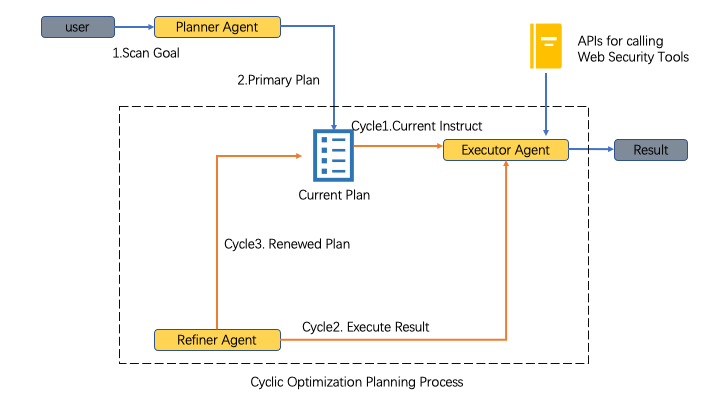

# PentestAssistant

An assistant for Web penetration detection automation based on LLMs such as ChatGLM, combined with function call techniques and multi-agent architectures, freeing up your hands and completing penetration tasks in a conversational stance.

### ⚠️ IMPORTANT NOTE

* Currently launched DEMO version, the project continues to develop iterative, welcome partners to join the discussion, provide valuable advice.
* Support back-end interface calls, front-end interface look forward to!

---

## Catalogue

* [INTRO](README_EN.md#INTRO)
* [UPDATE-LOG](README_EN.md#UPDATE-LOG)
* [QUICK-START](README_EN.md#QUICK-START)
    * [1. Environment-Configuration](README_EN.md#1-Environment-Configuration)
    * [2. Model-Download](README_EN.md#2-Model-Download)
    * [4. one-touch-start](README_EN.md#3-one-touch-start)
* [CONTACT-US](README_EN.md#CONTACT-US)


## Introduction

🤖 PentestAssistant is based on a Web-based penetration detection tool, builds a knowledge base of commonly used function call APIs, achieves penetration task establishment and maintenance through a multi-agent approach, and achieves the execution of penetration detection tasks based on RAG technology to complete the automation process of penetration detection.

✏️ The principle of the project is as follows：

1. Pre-processing: Build a knowledge base of Web penetration tools, collect commonly used methods, and compose an API of callable functions.
2. Task creation: Generate penetration testing tasks based on user requests and the penetration testing knowledge base
3. task polling：
    1. Based on the task list, match the functions available in the knowledge base, generate the execution sequence and run it, and feedback the results.
    2. Refresh penetration detection task status based on execution results
4. End of task: Generate a task report based on the results of the penetration testing task and tool execution




🥚 Support for two penetration detection use:

1. single tool call: specify the penetration detection tool, the user is given a natural language description of the task, the system automatically completes the tool call and execution according to the request
2. Multi-tool joint call: select a variety of penetration detection tools, the user is given a natural language description of the task, the system automatically selects the tool, the implementation of the function to achieve the requirements

✅ List of currently supported tools

| Tool                                                     | Function Number                       |
| -------------------------------------------------------- | -------------------------------- |
| [Nmap](https://nmap.org/)                                | 437 |
| [w3af](http://w3af.org/)               |  14    |
| [zaproxy](https://www.zaproxy.org/)              |   14   |
| [arachni](https://ecsypno.com/pages/arachni-web-application-security-scanner-framework)               | 14 |

## Change Log

[24/06/17] Support UI display, add frontend and backend
[24/05/27] First release, support for back-end API form access, support for Nmap calls

## Quick Start

### 1. Environment Configuration

First clone the repository source code

```shell
$ git clone https://github.com/HUSTInfSecLabs/PentestAssistant.git
```

For the botend, we recommend using conda to create a python virtual environment and using python-3.10

```shell
$ cd botend
$ conda create -n PentestAssistant python=3.10
$ python --version
Python 3.10.13
```

Install all dependencies in the virtual environment
```shell
$ conda activate PentestAssistant
$ pip install -r requirements.txt 
```

If pulling dependencies fails, you can replace the conda source, recommended Tsinghua source or CSU source

For the frontend and backend, we use node.js to implement the feature. For specific installation steps, refer to the README.md file in their directory.

### 2. Model Download

The project requires two types of models: the LLM and the Embedding, Reranker model.

#### LLM

Before the project is run, using local LLMs, which need to be downloaded and stored in local, common open source LLMs can usually be downloaded at [HuggingFace](https://huggingface.co/models)

After downloading the model, you need to modify the environment variables in the .env file to configure the model path, e.g. [ChatGLM3-6b](https://huggingface.co/THUDM/chatglm3-6b) Model.

```shell
# Usage
ChatGLM3_6b_AI__MODEL_TYPE="text-generation"

# model path
ChatGLM3_6b_AI__MODEL_PATH="/home/user/.cache/huggingface/hub/models--THUDM--chatglm3-6b"

# GPU usage
ChatGLM3_6b_AI__MODEL_DEVICE="0"
```

Some of the LLM are currently supported, including：[ChatGLM2-6b](https://huggingface.co/THUDM/chatglm2-6b), [ChatGLM3-6b](https://huggingface.co/THUDM/chatglm3-6b), [Llama2-6b](https://huggingface.co/meta-llama/Llama-2-7b-chat-hf), [Llama2-13b](https://huggingface.co/meta-llama/Llama-2-13b-chat-hf), [Llama3-8b-instruct](https://huggingface.co/meta-llama/Meta-Llama-3-8B-Instruct)


#### Embedding and Reranker Models

Configured in the same way as LLM, as in the [bge-reranker-large](https://huggingface.co/BAAI/bge-reranker-large) model:

```shell
# model path
RERANKER_EMBEDDING_NAME_OR_PATH="/home/user/.cache/huggingface/hub/models--BAAI--bge-reranker-large"
```

### 3. Start-up

Currently, the back-end startup method is supported and developed on port 8001, if you need to change the port, refer to the [api_flask.py](api_flask.py) file.

```shell
$ python api_flask.py
```

Future support for nice UI, support for conversations, history, and task browsing

## Contact Us

If you are also interested in this project, please contact us at HustInfSecLab@163.com.
